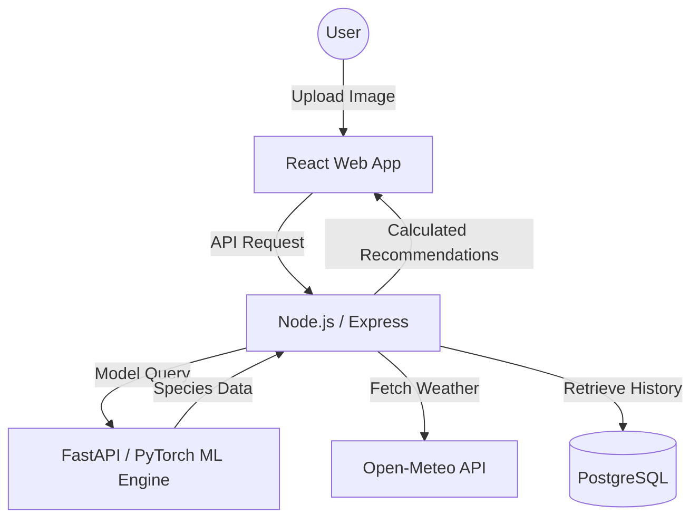

# FinAlogica — AI-Powered Fisheries Intelligence 🤖 🐟

### 🚀 [Live Demo](https://fin-alogica-main-6rka.vercel.app/) | [Backend API](https://finalogica-main-1.onrender.com/api/health) | [ML Engine](https://finalogica-main.onrender.com/docs)

**FinAlogica** is a high-performance, microservice-based ecosystem designed to provide intelligent fish identification and real-time fishing recommendations by bridging Computer Vision with live environmental data.

---

## 🌟 Core Features

- **AI Species Identification**: Leveraging a specialized `MobileNet-V3 Small` architecture for ultra-fast Image Classification.
- **Smart Environmental Logic**: Real-time integration with the **Open-Meteo API** to calculate optimal fishing conditions based on species biology and weather trends.
- **Cross-Platform Accessibility**: Seamless experience across a **React/Redux** web application and a **Streamlit** data dashboard.
- **Microservice Architecture**: Decoupled systems for Backend (Node.js/Express) and ML Inference (Python/FastAPI).

---

## 🏗️ System Architecture



---

## 🛠️ Tech Stack

| Component | Technology |
| :--- | :--- |
| **Frontend** | React, Redux Toolkit, Vite, CSS Modules |
| **Backend** | Node.js, Express, Neon PostgreSQL |
| **ML Engine** | Python, FastAPI, PyTorch, Torchvision |
| **Inference Tools** | Pillow, NumPy, ONNX-ready |
| **Dashboards** | Streamlit |
| **Deployment** | Vercel (Frontend), Render (Backend/ML) |

---

## 🚀 Getting Started

### 1. ML Engine (Python)
```bash
cd ml
python -m venv .venv && source .venv/bin/activate
pip install -r requirements.txt
python server.py
```

### 2. Backend API (Node.js)
```bash
cd backend
npm install
npm run dev
```

### 3. Frontend (React)
```bash
cd frontend
npm install
npm run dev
```

---

## 🔍 ML Model Details
The system uses a **MobileNet-V3 Small** backbone, pre-trained on ImageNet and fine-tuned/mapped for common fish species. It is specifically optimized for **low-memory environments** (Render Free Tier), utilizing only `torch.set_num_threads(1)` and CPU-based inference to maintain high availability without high overhead.

---

## 📈 Roadmap
- [ ] Implement YOLOv8 for real-time video species detection.
- [ ] Expand the species dictionary to include 100+ global varieties.
- [ ] Add historical catch tracking for predictive analytics.

---
*Developed by [Harsh](https://github.com/Derisionn)*
